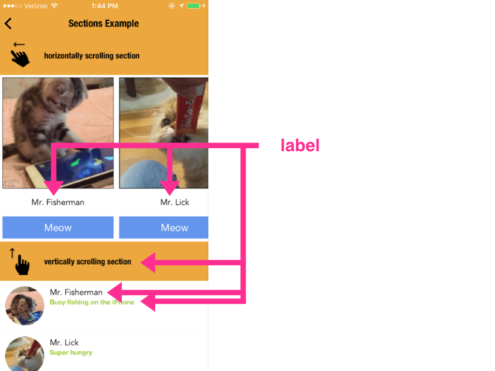
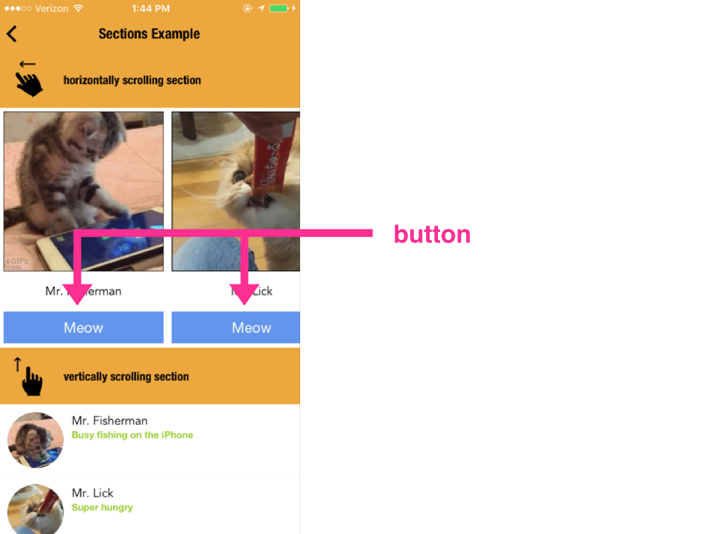
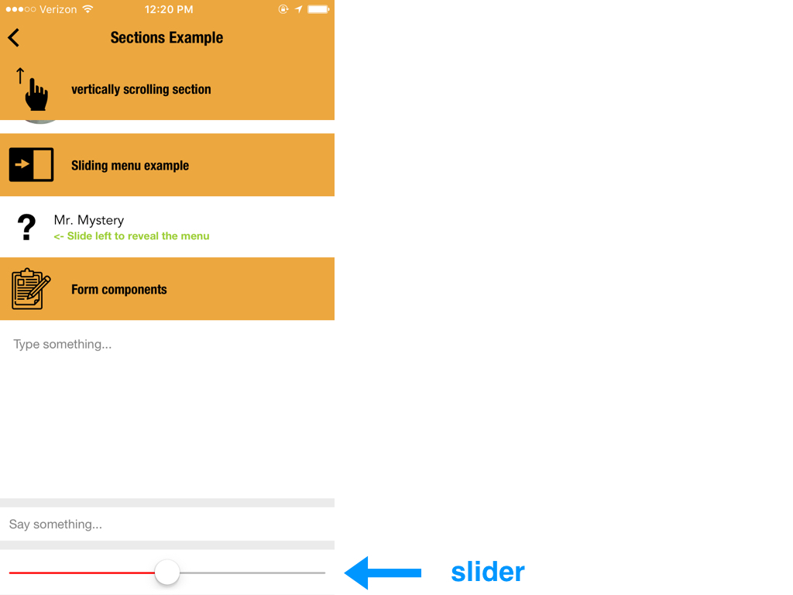
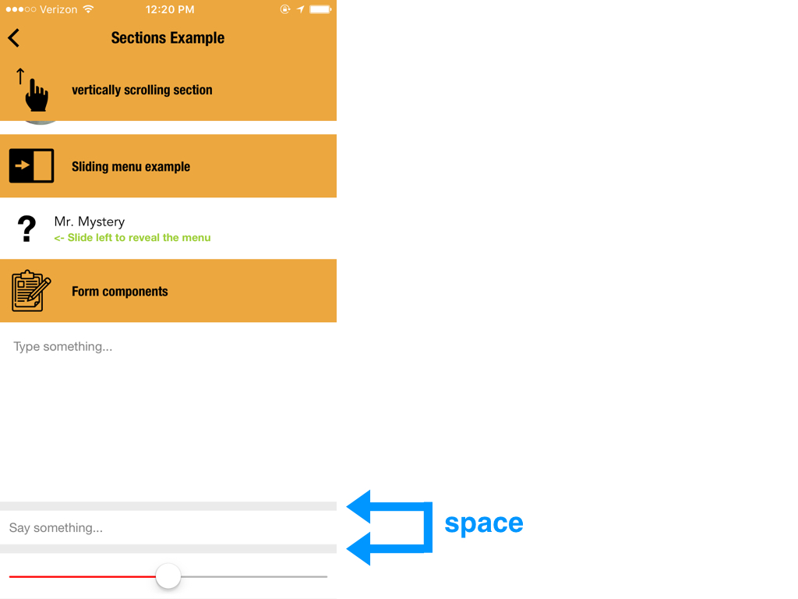

# Components
Components are user interface elements that can be used in different places, such as [items](document.md#user-content-body-sections-items), and [layers](document.md#user-content-body-layers).

- [label](#label)
- [image](#image)
- [button](#button)
- [textfield](#textfield)
- [textarea](#textarea)
- [slider](#slider)
- [html](#html)
- [space](#space)
- You can add more

## label

Static uneditable text element.



Example

```
{
	"type": "label",
	"text": "Hello world",
	"style": {
		"font": "Avenir",
		"size": "30",
		"color": "rgb(200,0,0)",
		"padding": "10"
	}
}
```
## image


### syntax

- url: image url
- style
  - corner_radius
  - width
  - height
  - color: To set the tint color (only for icons)

Example

```
{
	"type": "image",
	"url": "http://i.imgur.com/KUJPgGV.png",
	"style": {
		"width": "50",
		"height": "50",
		"corner_radius": "25"
	}
}
```

## button
- A basic component that reponds to user tap.
- Button is the only basic component which can directly have an [`action` attribute](interaction.md#action).
  - This is useful for [`sections.header`](document.md#user-content-body-sections-header) since a header on its own cannot respond to user tap event--sometimes you want to have a header react to user tap events.



Example

```
{
	"type": "button",
	"text": "http://i.imgur.com/KUJPgGV.png",
	"style": {
		"width": "50",
		"height": "50",
		"background": "#00ff00",
		"color": "#ffffff",
		"font": "HelveticaNeue",
		"size": "12",
		"corner_radius": "25"
	}
}
```

## textfield

- Single line input field
- textfields are seamlessly integrated with [local variables](actions.md#local-variable)


### Syntax
- `name`: name of the local variable to set.
- `value`: in case you wish to prefill the field.
- `placeholder`: Placeholder text for when there's no content filled in.
- `style`: style the textfield
  - background
  - align
  - autocorrect
  - autocapitalize
  - spellcheck
  - size
  - font
  - color
  - placeholder_color
  - secure: hide character input if set to `"true"`


Example 1: password input

```
{
	"type": "textfield",
	"name": "password",
	"value": "dhenf93f!",
	"placeholder": "Enter password",
	"style": {
		"placeholder_color": "#cecece",
		"font": "HelveticaNeue",
		"align": "center",
		"width": "200",
		"height": "60",
		"secure": "true",
		"size": "12"
	}
}
```

Example 2: autocorrect/autocaptiazlie/spellcheck input

```
{
	"type": "textfield",
	"name": "status",
	"placeholder": "Status update",
	"style": {
		"placeholder_color": "#cecece",
		"font": "HelveticaNeue",
		"align": "center",
		"width": "200",
		"height": "60",
		"autocorrect": "true",
		"autocapitalize": "true",
		"spellcheck": "true",
		"size": "12"
	}
}
```


## textarea

Multiline input field


- `name`: name of the local variable to set.
- `value`: in case you wish to prefill the field.
- `placeholder`: Placeholder text for when there's no content filled in.
- `style`: style the textfield
  - background
  - align
  - autocorrect
  - autocapitalize
  - spellcheck
  - size
  - font
  - color
  - placeholder_color

Example: Below, we've named the textarea `status`, and then refer to its value from `submit` action through the template expression `{{$get.status}}`

<pre><span style='color:silver;'>{
	"$jason": {
		"head": {
			"actions": {
				...
				<span style='color:black'>"submit": {
					"type": "$network.request",
					"options": {
						"url": "https://stts.jasonclient.org/status.json",
						"method": "post",
						"data": {
							"content": <span style='color:#ff0000;'>"{{$get.status}}"</span>
						}
					},
					"success": {
						"type": "$reload"
					}
				}</span>
				...
			}
		},
		"body": {
			...
			<span style='color:black'>{
				"type": "textarea",
				<span style='color:#ff0000;'>"name": "status",</span>
				"placeholder": "Status update",
				"value": "Eating lunch..",
				"style": {
					"background": "rgba(0,0,0,0)",
					"placeholder_color": "#cecece",
					"font": "HelveticaNeue",
					"align": "center",
					"width": "100%",
					"height": "300",
					"autocorrect": "true",
					"autocapitalize": "true",
					"spellcheck": "true",
					"size": "12"
				}
			}</span>
			...
		}
	}
}
</span></pre>

## slider

Horizontal slider input



### Syntax
- `name`: name of the local variable to set.
- `value`: value between 0 and 1 (in string) to preset the slider with. For example `"0.3"`
- `action`: [action](interaction.md#action) to execute after user completes the sliding gesture.
- `style`:
  - `width`
  - `height`
  - `color`

Example: Below, we set the slider's name `gauge` and triggers the `notice` action, which accesses its value whenever the user ends the sliding action.

<pre><span style='color:silver;'>{
	"$jason": {
		"head": {
			...
			<span style='color:black;'>"notice": {
				"type": "$util.alert",
				"options": {
					"title": "Volume changed",
					<span style='color:#ff0000;'>"description": "{{parseFloat($get.gauge)*100}}%"</span>
				}
			}</span>
			...
		},
		"body": {
			...
			<span style='color:black;'>{
				"type": "slider",
				<span style='color:#ff0000;'>"name": "gauge",</span>
				"action": {
					"trigger": "notice"
				}
			}</span>
			...
		}
	}
}</span></pre>


## html

- `text`: the HTML string
- `css`: CSS string to apply to the HTML. See below example.

You can also display html content, and even style them using CSS. However this is recommended only when you can get the content in HTML format. Normally it's recommended to receive content in JSON format and render them using rest of the components.

<pre><span style='color:silver;'>{
  "$jason": {
    "head": {
      "title": "RSS Reader",
      "description": "RSS Parsing example",
      "actions": {
        "$load": {
          "trigger": "reload"
        },
        "reload": {
          "type": "$network.request",
          "options": {
            "url": "http://feeds.gawker.com/lifehacker/full",
            "dataType": "rss"
          },
          "success": {
            "type": "$convert.rss",
            "options": {
              "data": "{{$jason}}"
            },
            "success": {
              "type": "$render"
            }
          }
        }
      },
      "templates": {
        "body": {
          "nav": {
            "style": {
              "background": "rgb(246, 246, 239)",
              "theme": "light",
              "color": "#000000"
            }
          },
          "style": {
            "background": "rgb(246, 246, 239)",
            "color": "#000000",
            "border": "0"
          },
          "sections": {
            "{{#each $jason}}": {
              "items": [
                <span style='color:black;'>{
                  "type": "html",
                  "css": "body{font-family: Courier; font-size: 18px;} img{max-width: 100%; border-bottom: 30px solid white !important;}",
                  "text": "<body>{{summary.replace(/width[ ]*=[ ]*\"[^\"]*\"/gi, '').replace(/height[ ]*=[ ]*\"[^\"]*\"/gi, '')}}</body>"
                }</span>
              ]
            }
          }
        }
      }
    }
  }
}</span></pre>

## space

An empty space component mostly used for layout purposes.



### Syntax

- style
  - background: background color (transparent if not specified)
  - width: only specify if you want a horizontally fixed size space
  - height: only specify if you want a vertically fixed size space

### Flexible size space
If you don't specify the style, the space component contracts or expands flexibly depending on it surrounding sibling components.

This is useful for when you wish to make special alignments, such as alinging one component to the left, and the other to the right in a horizontal layout.


<pre><span style='color:silver;'>{
	"type": "horizontal",
	"components": [
		<span style='color:black;'>{
			"type": "image",
			"url": "https://jasonclient.org/img/john.png",
			"style": {
				"width": "50"
			}
		}, 
		<span style='color:#ff0000;'>{
			"type": "space"
		},</span>
		{
			"type": "button",
			"text": "Follow"
			"style": {
				"width": "100",
				"height": "50"
			}
		}</span>
	]
}</span></pre>

### Fixed size space

You can also set the size of a space component.

<pre><span style='color:silver;'>{
	"type": "vertical",
	"components": [
		<span style='color:black;'>{
			"type": "image",
			"url": "https://jasonclient.org/img/john.png",
			"style": {
				"width": "50"
			}
		}, 
		<span style='color:#ff0000;'>{
			"type": "space",
			"style": {
				"height": "50"
			}
		},</span>
		{
			"type": "label",
			"text": "The names 'John Doe' or 'John Roe' for men, 'Jane Doe' or 'Jane Roe' for women, or 'Johnnie Doe' and 'Janie Doe' for children, or just 'Doe' non-gender-specifically are used as placeholder names for a party whose true identity is unknown or must be withheld in a legal action, case, or discussion."
		}</span>
	]
}</span></pre>
