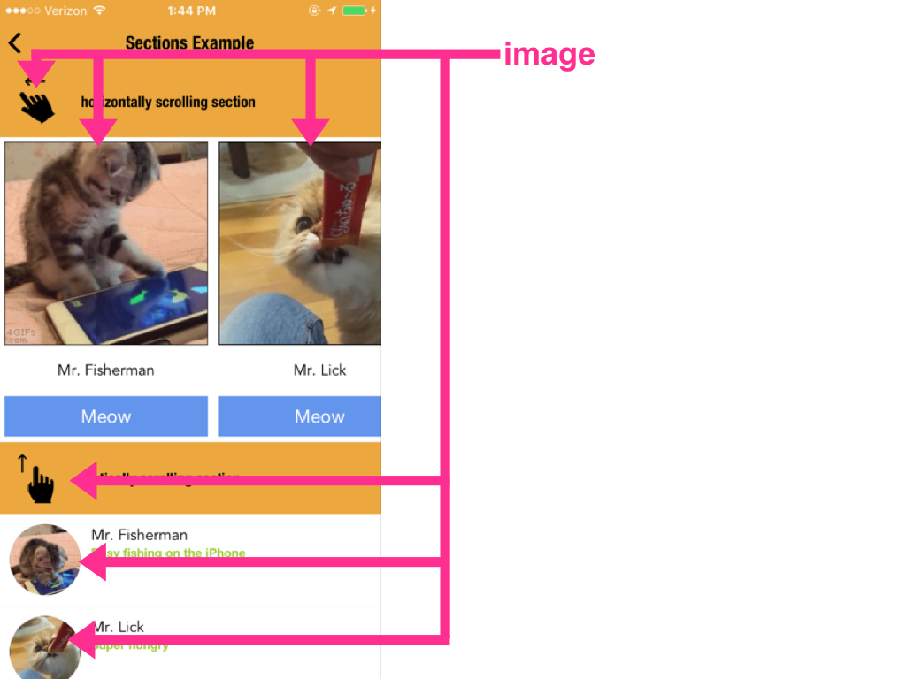
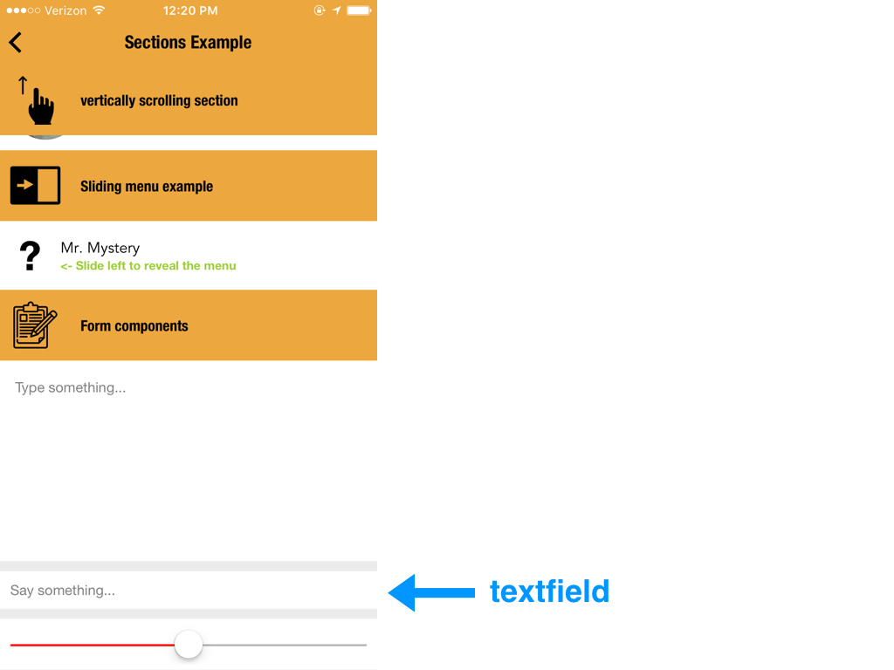
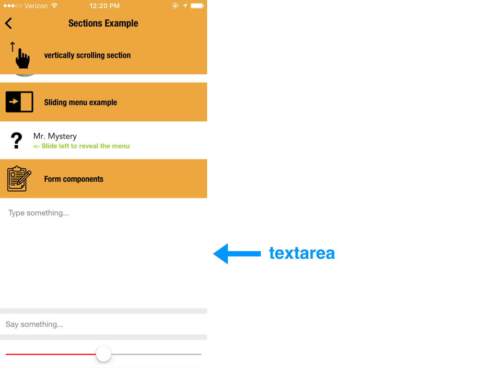

# Types of Components
Components are user interface elements that can be used in different places, such as [items](document.md#user-content-body-sections-items), and [layers](document.md#user-content-body-layers).

- [label](#label)
- [image](#image)
- [button](#button)
- [textfield](#textfield)
- [textarea](#textarea)
- [slider](#slider)
- [html](#html)
- [space](#space)
- [map](#map)
- Don't see what you want? [You can add more!](advanced.md#extension)

---

##■ label

Static uneditable text element.

###syntax

  - `type`: `"label"`
  - `text`: The text to display
  - `style`:
    - `font`: [text font name](http://iosfonts.com)
    - `size`: text size
    - `color`: text color in color code
    - `padding`: padding in pixels
    - `background`: background color of the label in color code
    - `corner_radius`: corner radius for the label

###example

    {
      "type": "label",
      "text": "Hello world",
      "style": {
        "font": "Avenir",
        "size": "30",
        "color": "rgb(200,0,0)",
        "padding": "10"
      }
    }

---

##■ image

Image loaded from either remote url or data-url

###syntax

  - `type`: `"image"`
  - `url`: image url
  - `style`
    - `corner_radius`: corner radius. use this to make the image rounded
    - `width`
    - `height`
    - `color`: To set the tint color (only for icons)

###example

    {
      "type": "image",
      "url": "http://i.imgur.com/KUJPgGV.png",
      "style": {
        "width": "50",
        "height": "50",
        "corner_radius": "25"
      }
    }

---

##■  button
A basic component that reponds to user tap.

 

###syntax

  - `type`: `"button"`
  - `text`: button text
  - `style`
    - `width`
    - `height`
    - `color`: text color
    - `background`: background color
    - `color`: To set the tint color (only for icons)
    - `corner_radius`: corner radius for the button

###Example

    {
      "type": "button",
      "text": "http://i.imgur.com/KUJPgGV.png",
      "style": {
        "width": "50",
        "height": "50",
        "background": "#00ff00",
        "color": "#ffffff",
        "font": "HelveticaNeue",
        "size": "12",
        "corner_radius": "25"
      }
    }

---

##■ textfield

Single line input field

 

textfields are seamlessly integrated with [local variables](actions.md#local-variable)

### syntax

  - `name`: name of the local variable to set.
  - `value`: in case you wish to prefill the field.
  - `placeholder`: Placeholder text for when there's no content filled in.
  - `style`: style the textfield
    - `background`
    - `align`
    - `autocorrect`: set to `"true"` to enable autocorrect
    - `autocapitalize`: set to `"true"` to enable autocapitalize
    - `spellcheck`: set to `"true"` to enable spellcheck
    - `size`: text size
    - `font`: text font
    - `color`: text color
    - `placeholder_color`: placeholder text color
    - `secure:` hide character input if set to `"true"`

### examples
####Example 1: password input

    {
      "type": "textfield",
      "name": "password",
      "value": "dhenf93f!",
      "placeholder": "Enter password",
      "style": {
        "placeholder_color": "#cecece",
        "font": "HelveticaNeue",
        "align": "center",
        "width": "200",
        "height": "60",
        "secure": "true",
        "size": "12"
      }
    }

####Example 2: autocorrect/autocaptiazlie/spellcheck input

    {
      "type": "textfield",
      "name": "status",
      "placeholder": "Status update",
      "style": {
        "placeholder_color": "#cecece",
        "font": "HelveticaNeue",
        "align": "center",
        "width": "200",
        "height": "60",
        "autocorrect": "true",
        "autocapitalize": "true",
        "spellcheck": "true",
        "size": "12"
      }
    }

---

##■ textarea

Multiline input field

  - `name`: name of the local variable to set.
  - `value`: in case you wish to prefill the field.
  - `placeholder`: Placeholder text for when there's no content filled in.
  - `style`: style the textfield
    - `background`
    - `align`: `"left"` | `"center"` | `"right"` (default is `"left"`)
    - `autocorrect`: set to `"true"` to enable autocorrect
    - `autocapitalize`: set to `"true"` to enable autocapitalize
    - `spellcheck`: set to `"true"` to enable spellcheck
    - `size`: text size
    - `font`: text font
    - `color`: text color
    - `placeholder_color`: placeholder text color

### example
Below, we've named the textarea `status`, and then refer to its value from `submit` action through the template expression `{{$get.status}}`

<pre>{
  "$jason": {
    "head": {
      "actions": {
        ...
        "submit": {
          "type": "$network.request",
          "options": {
            "url": "https://stts.jasonclient.org/status.json",
            "method": "post",
            "data": {
              "content": "{{$get.status}}"
            }
          },
          "success": {
            "type": "$reload"
          }
        }
        ...
      }
    },
    "body": {
      ...
      {
        "type": "textarea",
        "name": "status",
        "placeholder": "Status update",
        "value": "Eating lunch..",
        "style": {
          "background": "rgba(0,0,0,0)",
          "placeholder_color": "#cecece",
          "font": "HelveticaNeue",
          "align": "center",
          "width": "100%",
          "height": "300",
          "autocorrect": "true",
          "autocapitalize": "true",
          "spellcheck": "true",
          "size": "12"
        }
      }
      ...
    }
  }
}</pre>

---

##■ slider

Horizontal slider input

### syntax

  - `name`: name of the local variable to set.
  - `value`: value between 0 and 1 (in string) to preset the slider with. For example `"0.3"`
  - `action`: [action](actions.md) to execute after user completes the sliding gesture.
  - `style`
    - `width`
    - `height`
    - `color`

###example
Below, we set the slider's name `gauge` and triggers the `notice` action, which accesses its value whenever the user ends the sliding action.

<pre>{
  "$jason": {
    "head": {
      ...
      "notice": {
        "type": "$util.alert",
        "options": {
          "title": "Volume changed",
          "description": "{{parseFloat($get.gauge)*100}}%"
        }
      }
      ...
    },
    "body": {
      ...
      {
        "type": "slider",
        "name": "gauge",
        "action": {
          "trigger": "notice"
        }
      }
      ...
    }
  }
}</pre>

---

##■  html

Simple HTML content display. Normally it's more flexible to parse html content using [HTML template](templates.md#html)

###syntax

- `text`: the HTML string
- `css`: CSS string to apply to the HTML. See below example.

You can also display html content, and even style them using CSS. However this is recommended only when you can get the content in HTML format. Normally it's recommended to receive content in JSON format and render them using rest of the components.

###example
<pre>{
  "$jason": {
    "head": {
      "title": "RSS Reader",
      "description": "RSS Parsing example",
      "actions": {
        "$load": {
          "trigger": "reload"
        },
        "reload": {
          "type": "$network.request",
          "options": {
            "url": "http://feeds.gawker.com/lifehacker/full",
            "dataType": "rss"
          },
          "success": {
            "type": "$convert.rss",
            "options": {
              "data": "{{$jason}}"
            },
            "success": {
              "type": "$render"
            }
          }
        }
      },
      "templates": {
        "body": {
          "nav": {
            "style": {
              "background": "rgb(246, 246, 239)",
              "theme": "light",
              "color": "#000000"
            }
          },
          "style": {
            "background": "rgb(246, 246, 239)",
            "color": "#000000",
            "border": "0"
          },
          "sections": {
            "{{#each $jason}}": {
              "items": [
                {
                  "type": "html",
                  "css": "body{font-family: Courier; font-size: 18px;} img{max-width: 100%; border-bottom: 30px solid white !important;}",
                  "text": "<body>{{summary.replace(/width[ ]*=[ ]*\"[^\"]*\"/gi, '').replace(/height[ ]*=[ ]*\"[^\"]*\"/gi, '')}}</body>"
                }
              ]
            }
          }
        }
      }
    }
  }
}</pre>

---

##■  space

An empty space component mostly used for layout purposes.

### syntax

  - `style`
    - `background`: background color (transparent if not specified)
    - `width`: only specify if you want a horizontally fixed size space
    - `height`: only specify if you want a vertically fixed size space

### Example 1. Flexible size space
If you don't specify the style, the space component will contract or expand flexibly depending on its surrounding sibling components.

This is useful for when you wish to make special alignments, such as alinging one component to the left, and the other to the right in a horizontal layout.

<pre>{
  "type": "horizontal",
  "components": [
    {
      "type": "image",
      "url": "https://jasonclient.org/img/john.png",
      "style": {
        "width": "50"
      }
    }, 
    {
      "type": "space"
    },
    {
      "type": "button",
      "text": "Follow"
      "style": {
        "width": "100",
        "height": "50"
      }
    }
  ]
}</pre>

### Example 2. Fixed size space

You can also set the size of a space component.

<pre>{
  "type": "vertical",
  "components": [
    {
      "type": "image",
      "url": "https://jasonclient.org/img/john.png",
      "style": {
        "width": "50"
      }
    }, 
    {
      "type": "space",
      "style": {
        "height": "50"
      }
    },
    {
      "type": "label",
      "text": "The names 'John Doe' or 'John Roe' for men, 'Jane Doe' or 'Jane Roe' for women, or 'Johnnie Doe' and 'Janie Doe' for children, or just 'Doe' non-gender-specifically are used as placeholder names for a party whose true identity is unknown or must be withheld in a legal action, case, or discussion."
    }
  ]
}</pre>

##■  map

Map component

### syntax

• `type`: `"map"`
• `region` 
  - `coord`: Coordinate string in `LATITUDE,LONGITUDE` format, around which the map should be centered. (example: `"40.7146598,-73.9418602"`)
  - `width`: The width in meters in terms of how wide the map region should be
  - `height`: The height in meters in terms of how wide the map region should be
• `pins`: Array of pin objects. Each pin contains the following attributes:
  - `coord`: Coordinate string in `LATITUDE,LONGITUDE` format. (example: `"40.7146598,-73.9418602"`)
  - `title`
  - `description`
  - `style`
    - `selected`: display the annotation by default even when not tapped.
• `style`
  - `type`: `"satellite"` | `"hybrid"` | `"hybrid_flyover"` | `"satellite_flyover"`
  - `width`: width of the component to display
  - `height`: height of the component to display
  - `corner_radius`: corner radius of the component

### Example

    {
      "type": "map",
      "region": {
        "coord": "40.7197614,-73.9909211",
        "width": "100",
        "height": "100"
      },
      "pins": [{
        "title": "This is a pin",
        "description": "It really is.",
        "coord": "40.7197614,-73.9909211",
        "style": {
          "selected": "true"
        }
      }],
      "style": {
        "width": "100%",
        "height": "300"
      }
    }
