# Anatomy of a Jason document

A Jason document always starts with `$jason` as its root node, and has two children: `head` and `body`, each of which has multiple children of its own.

- [head](#user-content-head)
	- [title](#user-content-head-title)
	- [description](#user-content-head-description)
	- [icon](#user-content-head-icon)
	- [styles](#user-content-head-styles)
	- [actions](#user-content-head-actions)
	- [templates](#user-content-head-templates)
  - [data](#user-content-head-data)
- [body](#user-content-body)
	- [header](#user-content-body-header)
		- [title](#user-content-body-header-title)
		- [style](#user-content-body-header-style)
		- [menu](#user-content-body-header-menu)
		- [search](#user-content-body-header-search)
	- [sections](#user-content-body-sections)
		- [header](#user-content-body-sections-header)
		- [items](#user-content-body-sections-items)
	- [layers](#user-content-body-layers)
		- [label](#user-content-body-layers-label)
		- [image](#user-content-body-layers-image)
	- [footer](#user-content-body-footer)
		- [input](#user-content-body-footer-input)
		- [tabs](#user-content-body-footer-tabs)
  - [style](#user-content-body-style)
		
<h2 id='head'>Head</h2>

Head contains metadata that doesn't get displayed directly.  The title attribute is mandatory. Rest of the attributes are optional.

Head can contain the following:

1. [title](#user-content-head-title)
2. [description](#user-content-head-description)
3. [icon](#user-content-head-icon)
4. [styles](#user-content-head-styles)
5. [actions](#user-content-head-actions)
6. [templates](#user-content-head-templates)
7. [data](#user-content-head-data)

>### Example
><pre>
><span style='color:silver;'>{
>	"$jason": {
>		<span style='color:black;'>"head": {
>			"title": "...",
>			"description: "...",
>			"icon": "...",
>			"styles": {
>				...
>			},
>			"actions": {
>				...
>			},
>			"templates": {
>				...
>			},
>			"data": {
>				...
>			}
>		},</span>
>		"body": {
>			...
>		}
>	}
>}</span>
></pre>

<h3 id='head-title'>title</h3>
Title string for your app. Will be displayed on the header by default.

<pre>
<span style='color:silver;'>{
	"$jason": {
		"head": {
			<span style='color:black;'>"title": "Hello World",</span>
			...
		},
		...
	}
}</span>
</pre>


<h3 id='head-description'>description</h3>
Description string for your app. Let users find out what the app does, how it works, etc. just by looking at the JSON code.

<pre>
<span style='color:silver;'>{
	"$jason": {
		"head": {
			"title": "Hellow World",
			<span style='color:black;'>"description": "This app displays 'Hello World' on the screen",</span>
			...
		},
		...
	}
}</span>
</pre>

<h3 id='head-icon'>icon</h3>
An icon URL that represents your app.

<pre>
<span style='color:silver;'>{
	"$jason": {
		"head": {
			"title": "Hellow World",
			"description": "This app displays 'Hello World' on the screen",
			<span style='color:black;'>"icon": "https://s3.amazonaws.com/jasonclient/hello.png",</span>
			...
		},
		...
	}
}</span>
</pre>

<h3 id='head-styles'>styles</h3>
Normally you can style elements by attaching `style` attributes to UI elements. However, sometimes it makes sense to assign them a `class` and style them all at once using the common style.

> This is similar to `<style>` tag in HTML

For example here's an example of `inline styling`:

<pre>
<span style='color:silver;'>{
	"$jason": {
		"head": {
			...
		},
		"body": {
			"sections": [{
				"items": [{
					"type": "label",
					"text": "This is row 1",
					<span style='color:black'>"style": {
						"font": "HelveticaNeue",
						"size": "20",
						"color": "#ff0000",
						"padding": "10"
					}</span>
				}, {
					"type": "label",
					"text": "This is row 2",
					<span style='color:black'>"style": {
						"font": "HelveticaNeue",
						"size": "20",
						"color": "#ff0000",
						"padding": "10"
					}</span>
				}, {
					"type": "label",
					"text": "This is row 3",
					<span style='color:black'>"style": {
						"font": "HelveticaNeue",
						"size": "20",
						"color": "#ff0000",
						"padding": "10"
					}</span>
				}]
			}]
		}
	}
}</span>
</pre>

You can give each item a `class` (in this case `styled_row`), and style them altogether inside `styles` using the class name, like this:

<pre>
<span style='color:silver;'>{
	"$jason": {
		"head": {
			...
			<span style='color:black'>"styles": {
				"styled_row": {
					"font": "HelveticaNeue",
					"size": "20",
					"color": "#ff0000",
					"padding": "10"
				}
			}</span>
		},
		"body": {
			"sections": [{
				"items": [{
					"type": "label",
					"text": "This is row 1",
					<span style='color:black'>"class": "styled_row"</span>
				}, {
					"type": "label",
					"text": "This is row 2",
					<span style='color:black'>"class": "styled_row"</span>
				}, {
					"type": "label",
					"text": "This is row 3",
					<span style='color:black'>"class": "styled_row"</span>
				}]
			}]
		}
	}
}</span>
</pre>

<h3 id='head-actions'>actions</h3>

- [How does it work?](#how-it-works)
- [Comparison vs. inline action](#comparison-with-inline-actions)
- [System actions](#system-actions)

#### How it works

Just like you can attach `style` attributes inline to view components to style them, you can attach [action](actions.md) attributes inline to UI elements to handle tap events.

Likewise, similar to `styles` attribute above, you can define frequently used action handlers inside [head](#head), under `actions` attribute.

> This is similar to `<script>` tag in HTML.

#### Comparison with inline actions

For example, here we display multiple `items`, and each item has the same `action` attribute content.

<pre>
<span style='color:silver;'>{
	"$jason": {
		"head": {
			...
		},
		"body": {
			"sections": [{
				"items": [{
					"type": "label",
					"text": "This is row 1",
					<span style='color:black'>"action": {
						"type": "$network.request",
						"options": {
							"url": "https://jasonclient.org/submit",
							"method": "POST"
						},
						"success": {
							"type": "$render"
						}
					}</span>
				}, {
					"type": "label",
					"text": "This is row 2",
					<span style='color:black'>"action": {
						"type": "$network.request",
						"options": {
							"url": "https://jasonclient.org/submit",
							"method": "POST"
						},
						"success": {
							"type": "$render"
						}
					}</span>
				}, {
					"type": "label",
					"text": "This is row 3",
					<span style='color:black'>"action": {
						"type": "$network.request",
						"options": {
							"url": "https://jasonclient.org/submit",
							"method": "POST"
						},
						"success": {
							"type": "$render"
						}
					}</span>
				}]
			}]
		}
	}
}</span>
</pre>

Below we have the same example, but using `actions` instead of re-defining the same action every time inline. Here's how it works:

1. Define a named action inside `head.actions` (in this case we've named it `submit_item`).
2. `trigger` the action from anywhere using the name.

<pre>
<span style='color:silver;'>{
	"$jason": {
		"head": {
			...
			"actions": {
				<span style='color:black'>"submit_item": {
					"type": "$network.request",
					"options": {
						"url": "https://jasonclient.org/submit",
						"method": "POST"
					},
					"success": {
						"type": "$render"
					}
				}</span>
			}
		},
		"body": {
			"sections": [{
				"items": [{
					"type": "label",
					"text": "This is row 1",
					<span style='color:black'>"action": {
						"trigger": "submit_item"
					}</span>
				}, {
					"type": "label",
					"text": "This is row 2",
					<span style='color:black'>"action": {
						"trigger": "submit_item"
					}</span>
				}, {
					"type": "label",
					"text": "This is row 3",
					<span style='color:black'>"action": {
						"trigger": "submit_item"
					}</span>
				}]
			}]
		}
	}
}</span>
</pre> 

#### System actions

Some actions are automatically triggered by the system when a certain event occurs. When you wish to take advantage of these, simply add them to `actions`. They are:

1. `$load`: Gets called once automatically when the view loads for the first time
	
  >   **Example**
  >   
  >   When the view loads, make a network request, and then render the response using the template.
  >  
  ><pre>{
  >  ...
  >   "$load": {
  >     "type": "$network.request",
  >     "options": {
  >      "url": "http://jasonclient.org/req.json"
  >     },
  >     "success": {
  >      "type": "$render"
  >     }
  >  }
  >  ...
  >}</pre>
			
	
	
2. `$show`: Gets called automatically whenever the view appears. For example when coming back from a modal view, coming back from its next view via back button, etc.
  
  >   **Example**
  >
  >   Whenever view gets displayed, reload the current view to update content.
  >  
  ><pre>{
  >   ...
  >   "$show": {
  >     "type": "$reload"
  >   },
  >   ...
  >}</pre>
	
		
3. `$foreground`: Whenever the app comes back from the background state

  >   **Example**
  >
  >   Whenever view comes back from background, reload the current view to update 
  >  
  ><pre>{
  >   ...
  >   "$foreground": {
  >     "type": "$reload"
  >   },
  >   ...
  >}</pre>
	
	
4. `$pull`: Whenever user makes a pull to refresh action

  >   **Example**
  >
  >   Whenever user makes a pull-to-refresh gesture, reload the current view to update 
  >  
  ><pre>{
  >   ...
  >   "$pull": {
  >     "type": "$reload"
  >   },
  >   ...
  >}</pre>
	

<h3 id='head-templates'>templates</h3>
Normally you can just return a static JSON document and Jason would do its job to render it. However sometimes you may want to return just a template--without data--and render it based on dynamically generated or fetched data.

You can learn more about [the template syntax here](templates.md)

> If you know web programming, this is similar to using [HTML templating (`<template>` tag)](https://developer.mozilla.org/en-US/docs/Web/HTML/Element/template).

---

Here are some cases where using a template makes sense:


1. [Make a separate network request for data, then render the response](#1make-a-separate-network-request-for-data-then-render-the-response)

2. [Dynamically render local data](#2-dynamically-render-local-data)

3. [Dynamically render data generated from device sensors](#3-dynamically-render-data-generated-from-device-sensors)

4. [Separate data from template for less redundancy](#4-separate-data-from-template-for-less-redundancy)

---

####1.Make a separate network request for data, then render the response

- **Network request to a 3rd party API:** Let's say we want to build a Twitter client. What we want to do is:

  1. Fetch the data by making a network request to Twitter API.
  2. Render the data using our own template.

- **Instant plug and play:** Most web development frameworks nowadays come with JSON API right out of the box. This means you can simply write a template and render your own existing API.

	For example here's a Jason markup that renders a list of labels:
	
	<pre id='static-json-example'>
	<span style='color:silver;'>{
		"$jason": {
			"head": {
				...
			},
			"body": {
				"sections": [{
					<span style='color:black'>"items": [{
						"type": "label",
						"text": "This is row 1"
					}, {
						"type": "label",
						"text": "This is row 2"
					}, {
						"type": "label",
						"text": "This is row 3"
					}, {
						"type": "label",
						"text": "This is row 4"
					}, {
						"type": "label",
						"text": "This is row 5"
					}, {
						"type": "label",
						"text": "This is row 6"
					}, {
						"type": "label",
						"text": "This is row 7"
					}, {
						"type": "label",
						"text": "This is row 8"
					}]</span>
				}]
			}
		}
	}</span>
	</pre> 
	
	Instead of this static JSON, we can:
	
	1. Return a `body template`.
	2. Make a separate network request just to fetch the data.
	3. Render the fetched data using the template.
	
	Here's what it looks like:
	
	<pre>
	<span style='color:silver;'>{
		"$jason": {
			"head": {
				...
				<span style='color:black'>"actions": {
					"$load": {
						"type": "$network.request",
						"options": {
							"url": "https://jasonclient.org/rownames.json"
						},
						"success": {
							"type": "$render"
						}
					}
				},
				"templates": {
					"body": {
						"sections": [{
							"items": {
								"{{#each $jason.result}}": {
									"type": "label",
									"text": "This is row {{row_name}}"
								}
							}
						}]
					}
				}</span>
			}
		}
	}</span>
	</pre> 
	
	Here, the Jason document **does not** have a top level `body` attribute. Instead it contains a `templates` attribute, which contains a template named `body`.
	
	Also the [`actions` attribute contains a $load attribute](#system-actions), so this will be triggered as soon as the view loads.
	
	So putting all these together, here's what's going on:
	
	1. The Jason app loads the JSON shown above, from our server.
	2. There's no `body` attribute so nothing is rendered on the screen by default. However, notice there's a `body` attribute under `templates`. This is the template that will be rendered as the `body` later.
	3. Immediately after the view loads, the `$load` action gets automatically triggered by the system.
	4. `$load` makes a `$network.request` call with the url specified. We will need to return the following data from the API:
		
			{
				"result": [{
					"row_name": "1"
				}, {
					"row_name": "2"
				}, {
					"row_name": "3"
				}, {
					"row_name": "4"
				}, {
					"row_name": "5"
				}, {
					"row_name": "6"
				}, {
					"row_name": "7"
				}, {
					"row_name": "8"
				}]
			}
	
	5. Once `$network.request` succeeds, its `success` action gets executed next. In this case it's `$render`.
	6. `$render` draws the view [using the `body` template and the data from the network request](actions.md#render).
  7. The result is the same as the [original static JSON](#user-content-static-json-example).

	
	
####2. Dynamically render local data:

You can render templates using any type of data, which includes **local variables** you can set using form components such as:

- textfield
- textarea
- menu
- etc.


**Example:** Below, we render the label using a local variable named `message`, which is automatically set whenever the `textfield` value changes. **Note that there is no top level `body` element after `head`.** Instead we have a `body` template, which will be rendered into body whenever we call the `$render` action. 
	

```
{
  "$jason": {
    "head": {
      ...
      "actions": {
        "$load": {
          "type": "$render"
        },
        "$pull": {
          "type": "$render"
        }
      },
      "templates": {
        "body": {
          ...
          "items": [
            {
              "type": "textfield",
              "name": "message"
            },
            {
              "type": "label"
              "text": {{$get.message}}"
            }
          ]
          ...
        }
      }
    }
  }
}
```
	
####3. Dynamically render data generated from device sensors

- geolocation
- addressbook
- camera
- timer
- etc.

**Example:** Below, we access the geolocation device sensor and render its result. Since our server has no knowledge of the device sensor data, templates are the only way to go in this case.


```
{
  "$jason": {
    "head": {
      ...
      "actions": {
        "$load": {
          "type": "$geo.get",
          "success": {
            "type": "$render"
          }
        }
      },
      "templates": {
        "body": {
          ...
          "items": [
            {
              "type": "label"
              "text": {{$jason.coord}}"
            }
          ]
          ...
        }
      }
    }
  }
}
```

####4. Separate data from template for less redundancy

Sometimes you simply want to separate view from model to avoid lots of code redundancy. See the below [data](#user-content-head-data) section for details.

<h3 id='head-data'>data</h3>

`data` attribute is used to automatically fill in the `body` template if one exists, in order to render the view.

When you include a `data` attribute to `head`, Jason assumes that when the view loads:

1. It should parse `data` with `templates.body`.
2. And render it into the view automatically.

Here's a Jason markup **without** a template/data. As you can see, the label items mostly repeat, except for the `text` attribute.

```
{
  ...
  "body": {
    "sections": [
      "items": [
        {
          "type": "label",
          "text": "Ethan",
          "style": {
            "color": "#000000",
            "size": "14",
            "font": "HelveticaNeue-Bold",
            "padding": "10",
            "background": "rgba(0,0,0,0.5)",
            "width": "300",
            "height": "100"
          }
        }
        ...
        {
          "type": "label",
          "text": "John",
          "style": {
            "color": "#000000",
            "size": "14",
            "font": "HelveticaNeue-Bold",
            "padding": "10",
            "background": "rgba(0,0,0,0.5)",
            "width": "300",
            "height": "100"
          }
        }
        {
          "type": "label",
          "text": "Samantha",
          "style": {
            "color": "#000000",
            "size": "14",
            "font": "HelveticaNeue-Bold",
            "padding": "10",
            "background": "rgba(0,0,0,0.5)",
            "width": "300",
            "height": "100"
          }
        }
      ]
    ]
  }
}
```

Using template/data, we can reduce it down to:

```
{
  "head": {
    "data": {
      "names": ["Ethan", ..., "John", "Samantha"]
    },
    "templates": {
      "body": {
        "sections": [{
          "items": {
            "{{#each names}}": {
              "type": "label",
              "text": "Ethan",
              "style": {
                "color": "#000000",
                "size": "14",
                "font": "HelveticaNeue-Bold",
                "padding": "10",
                "background": "rgba(0,0,0,0.5)",
                "width": "300",
                "height": "100"
              }
            }
          }]
        }
      }
    }
  }
}
```

##body

Body contains everything that gets displayed on the screen. A body is made up of the following view elements.

1. [header:](#user-content-body-header) The top navigation bar and its attached components.
2. [sections:](#user-content-body-sections) The main region used to display scrollable content.
3. [layers:](#user-content-body-layers) Floating items at fixed positions
4. [footer:](#user-content-body-footer) The bottom bar.
5. [style:](#user-content-body-style) Styling the body

<pre>
<span style='color:silver'>{
	"$jason": {
		"head": {
			...
		},
		<span style='color:black;'>"body": {
			"header": {
				...
			},
			"sections": [
				{ ... },
				{ ... },
				...
			],
			"layers": [
				{ ... },
				{ ... },
				...
			],
			"footer": {
				...
			}
		}</span>
	}
}</span>
</pre>

>### Example 1. body with scrollable sections
>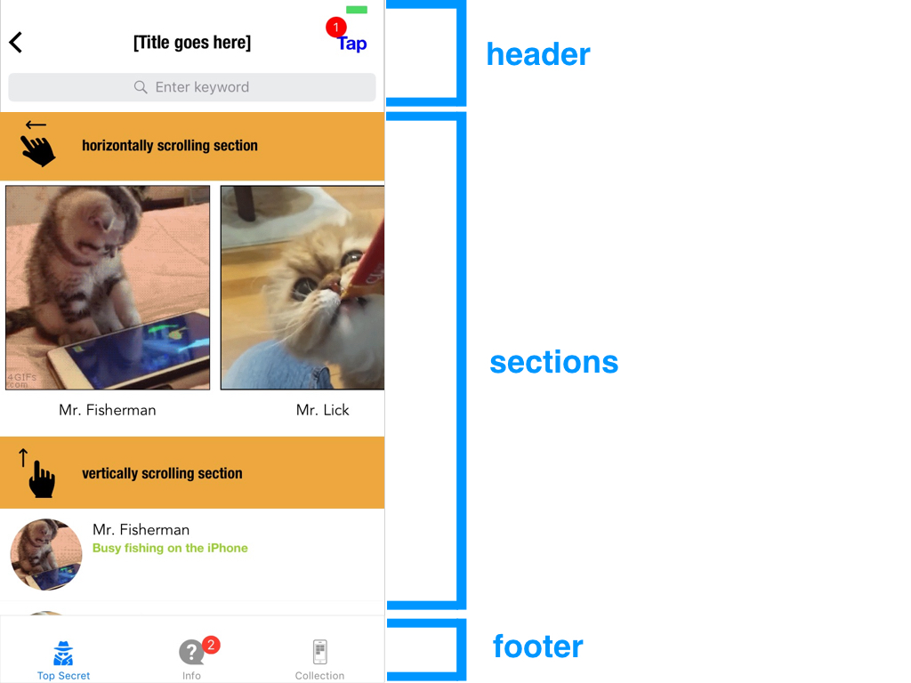

>### Example 2. body with floating layers
>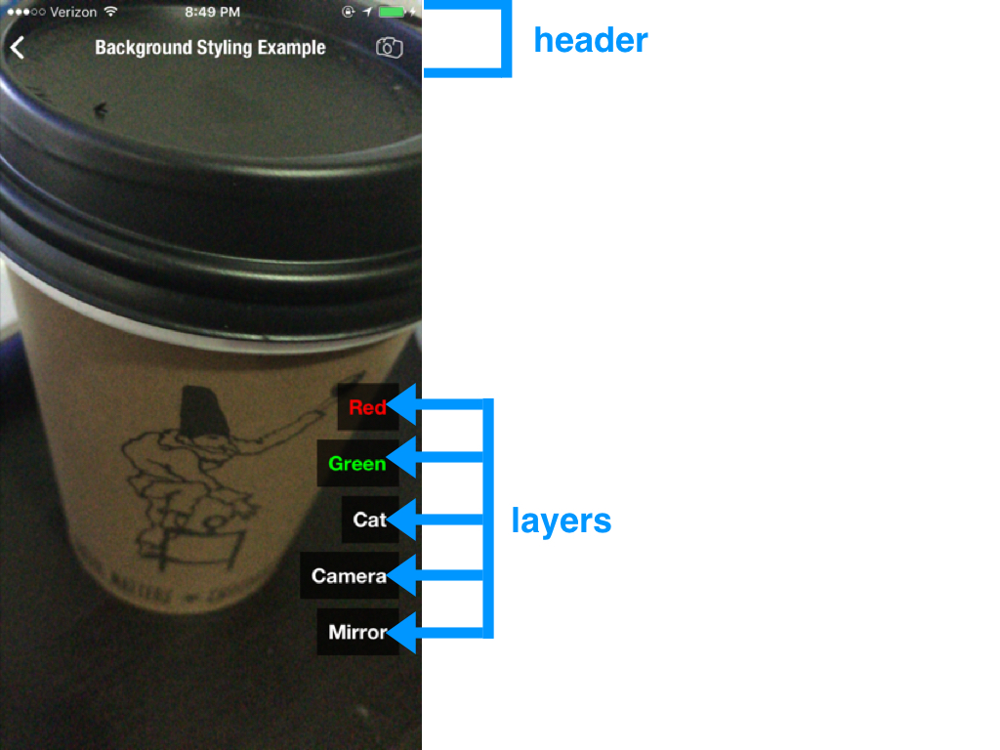
    	
<h3 id='user-content-body-header'>1. Header</h3>

Top navigation bar and its components.

<h4 id='user-content-body-header-title'>title</h4>
Set this to change the title on the header bar. If you don't specify this field, the [head.title attribute](#user-content-head-title) will be used.

>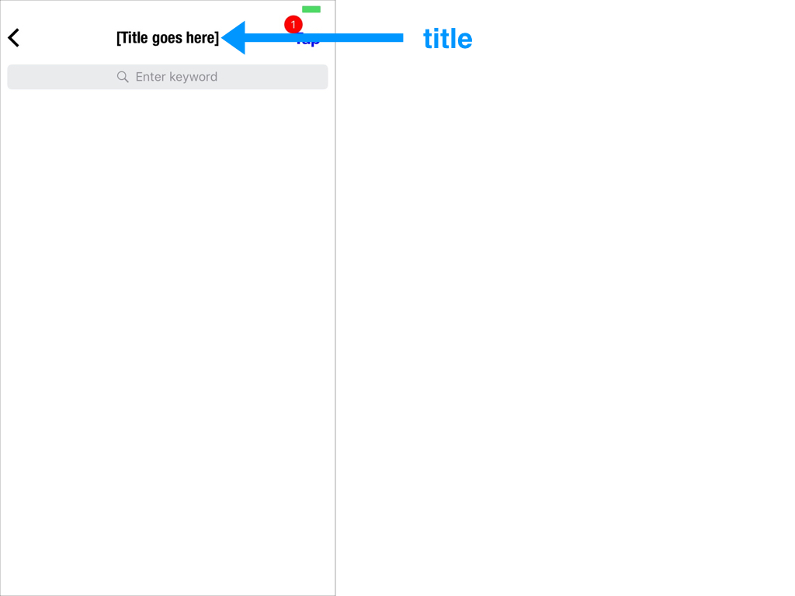

<h4 id='user-content-body-header-style'>style</h4>
Style the header bar.

>##### Available attributes
>- font: the [title](#user-content-body-header-title) font
>- size: the [title](#user-content-body-header-title) size
>- background: the background color for the header bar

<h4 id='user-content-body-header-search'>search</h4>
Search component which can trigger an `action`.

>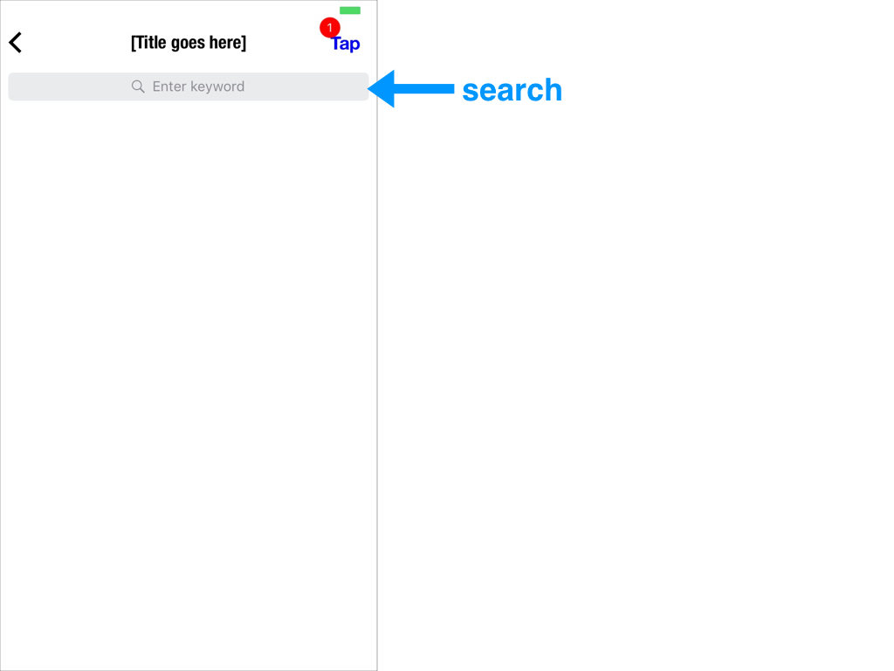

>##### Available attributes
>
> - name
> - placeholder
> - action
> - style
>   - background: background color

<pre><span style='color:silver;'>{
	"$jason": {
		"head": {
			...
		},
		"body": {
			"header": {
				<span style='color:black;'><span style='color:#ff0000;'>"search":</span> {
          "name": "query_text",
          "placeholder": "Search something",
          "style": {
            "background": "#000000"
          },
          "action": {
            "type": "$util.alert",
            "options": {
              "title": "You've entered:",
              "description": "{{$get.query_text}}"
            }
          }
        }</span>
      }
    }
  }
}</span></pre>

<h4 id='user-content-body-header-menu'>menu</h4>
Menu button which can trigger an `action` when tapped.

>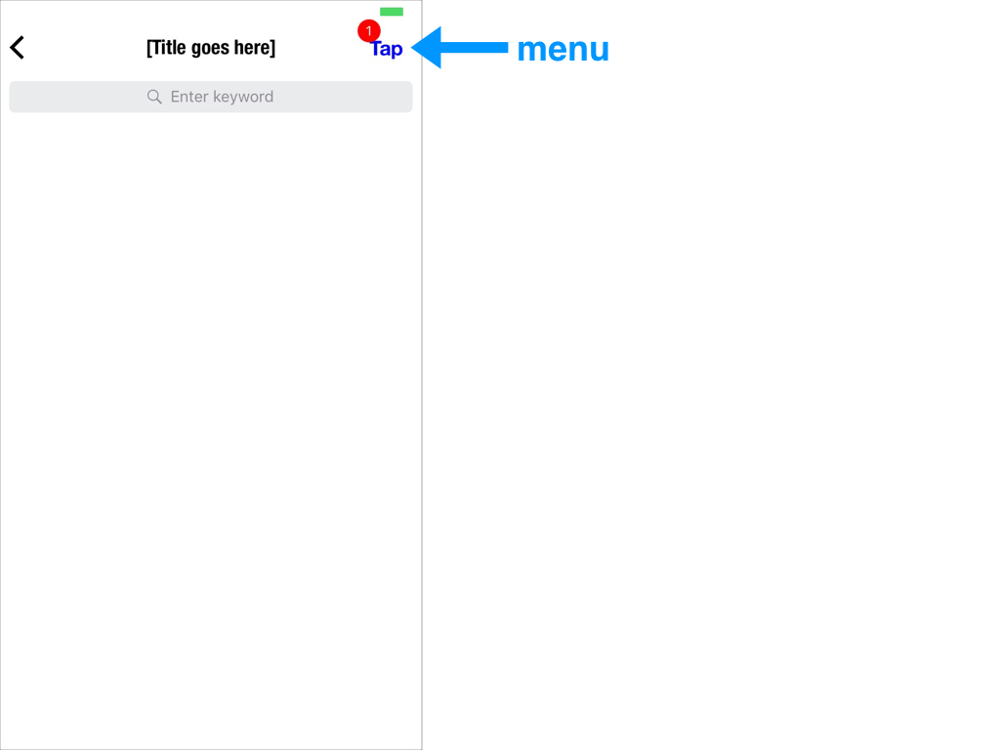

>##### Available attributes
> - text: menu button text
> - image: menu button icon url
> - style
>   - color: font color or image mask color
>   - font: font name
>   - size: font size
> - [href](interaction.md#href)
> - [action](interaction.md#action)
> - badge
>   - text: The text to display inside the badge
>   - style:
>     - background: background color for the badge
>     - color: text color for the badge
>     - top: x-offset of the badge
>     - left: y-offset of the badge
>   
>#####Example
>
>   <pre>{
>     "menu": {
>       "text": "Tap me",
>       "style": {
>         "color": "#0000ff",
>         "font": "HelveticaNeue-Bold",
>         "size": "17"
>       },
>       "action": {
>         "type": "$util.toast",
>         "options": {
>           "text": "Good job!"
>         }
>       },
>       "badge": {
>         "text": "3",
>         "style": {
>           "background": "#ff0000",
>           "color": "#ffffff"
>         }
>       }
>     }
>   }</pre>
>
> [View the entire code here](http://www.jasonbase.com/things/qp5/edit)

>##### Note
>- Choose either `text` or `image` for the menu button, but not both.
>- Choose either `href` or `action` for handling tap events, but not both.

<pre><span style='color:silver;'>{
	"$jason": {
		"head": {
			...
		},
		"body": {
			"header": {
				<span style='color:black;'><span style='color:#ff0000;'>"menu":</span> {
					"text": "Menu",
					"action": {
						"type": "$util.alert",
						"options": {
							"title": "Menu",
							"description": "You've pressed the menu"
						}
					}
				}</span>
			}
		}
	}
}</span></pre>


<h3 id='user-content-body-sections'>2. Sections</h3>

The main region, used to display scrollable content.

- Each section is made up of a `header` (optional) and `items`.
- In most cases one section is enough. You just need multiple items.
- Use multiple sections if you have more than one distinct types of collections.

#### Style
- There are two types of sections:
  1. [vertically scrolling (default)](#1-vertically-scrolling-section)
  2. [horizontally scrolling](#2-horizontally-scrolling-section)

Horizontally scrolling section | Vertically scrolling section
-------------------------------|------------------
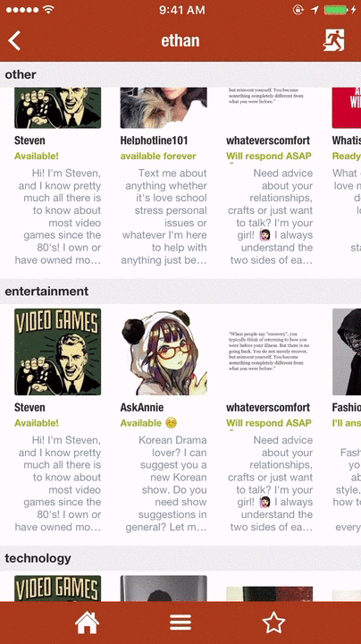 | 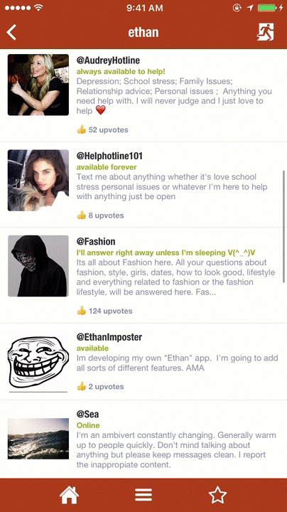

##### 1. Vertically scrolling section
- This is just a regular list view that lets you scroll from top to bottom.
- This is the default

##### 2. Horizontally scrolling section
- This type of section lets you scroll from left to right.
- To create a horizontal section, add `"horizontal": "true"` under the section's `style` attribute.

<pre><span style='color:silver;'>{
	...
	"sections": [
		...
		{
			<span style='color:black;'>"style": {
				"horizontal": "true"
			},</span>
			"items": [{
				"type": "label",
				"text": "Item 1"
			}, {
				"type": "label",
				"text": "Item 2"
			}, {
				"type": "label",
				"text": "Item 3"
			}, {
				"type": "label",
				"text": "Item 4"
			}, {
				"type": "label",
				"text": "Item 5"
			}]
		}
		...
	]
}</span></pre>

<h4 id='body-sections-item-types'>Section item types</h4>

Each section can have:

  1. up to 1 [header](#user-content-body-sections-header)
  2. 1 or more [items](#user-content-body-sections-items)

Section Type                   | Structure
-------------------------------|------------------
Horizontal | 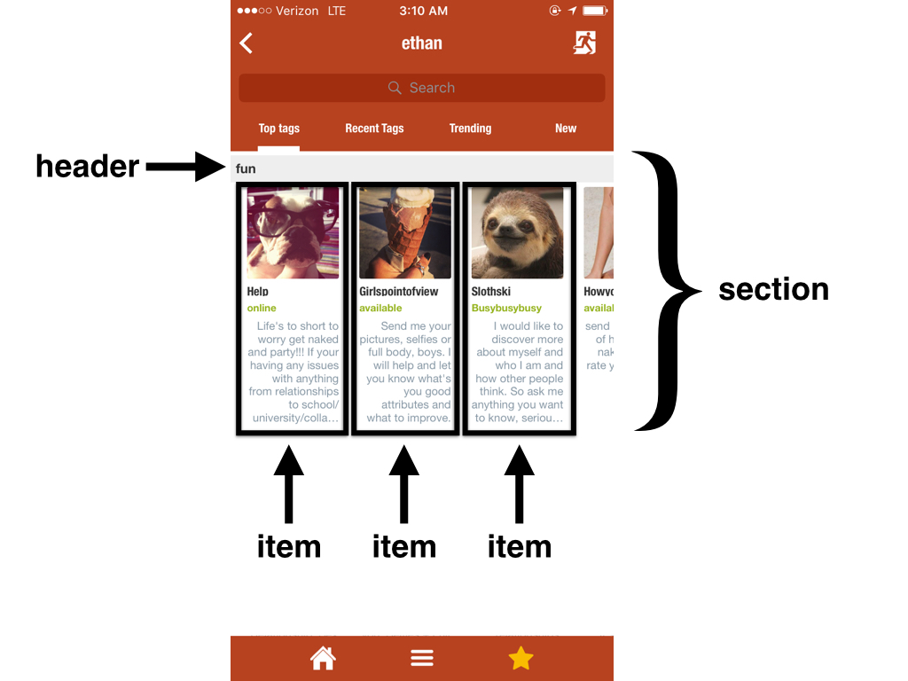
Vertical   | 


<h4 id='user-content-body-sections-header'>Header</h4>
A header is a readonly item that sticks to the top of the screen when you scroll.

- A header can be a single basic component (such as label or image), but in most cases we use a sophisticated nested layout. [Learn more about item layout](layout.md) and [components](components.md)
- There can be at most one header for each section. (optional)
- While you can attach `href` or `action` to `items`, you cannot attach them to a `header`, because `header` is used for display purpose only.
- If you want to attach an `action` to a header, you can do so by including a `button` component, and attach `action` attribute to the `button`.

>##### Available attributes
>
> - `type`: vertical or horizontal
> - `components`: child components
> - `style`: layout style + item specific style
>   - `color`: Set the color of the item's disclosure indicator in case [href](interaction.md#href) is used.
>   - `height`: Set the height of the item.
>   - `z_index`: An integer value (example: `{"z_index": "-1"}`). Set the z-index of the header. (Similar to [CSS z-index](https://developer.mozilla.org/en-US/docs/Web/CSS/z-index))

<h4 id='user-content-body-sections-items'>Items</h4>

Items array contains a list of items that users can interact with.

- Items can be a single basic component (such as label or image), but in most cases we use a sophisticated nested layout. [Learn more about item layout](layout.md) and [components](components.md)
- Unlike a `header`, you can interact with `items`. Just attach `action`, `href`, or `menu` attribues to make them respond to user tap events.
- Items don't stick to top when you scroll.


>##### Available attributes
>
> - `type`: vertical or horizontal
> - `components`: child components
> - `style`: layout style + item specific style
>   - `color`: Set the color of the item's disclosure indicator in case [href](interaction.md#href) is used.
>   - `height`: Set the height of the item.
>   - `z_index`: An integer value (example: `{"z_index": "-1"}`). Set the z-index of the item. (Similar to [CSS z-index](https://developer.mozilla.org/en-US/docs/Web/CSS/z-index))
> - `action`: [action](interaction.md#action) to trigger when a user taps the item
> - `href`: [href](interaction.md#href) to trigger when a user taps the item
> - `menu`: [menu](interaction.md#menu) to display when a user swipes the item to the left.

You can manually fill out items like this:

```
{
	...
	"items": [
		{
			"type": "vertical",
			"components": [{
				"type": "image",
				"url": "https://jasonclient.org/img/john.png"
			}, {
				"type": "label",
				"text": "John"
			}, {
				"type": "label",
				"text": "Doe"
			}]
		},
		{
			"type": "vertical",
			"components": [{
				"type": "image",
				"url": "https://jasonclient.org/img/mary.png"
			}, {
				"type": "label",
				"text": "Mary"
			}, {
				"type": "label",
				"text": "Jane"
			}]
		},
		...
	]
	...
}
```

or use a [template](#templates.md) to iterate through an array to build it.

<h3 id='user-content-body-layers'>3. Layers</h3>

Layers are floating elements that can be configured to be resized, repositioned, rotated, and react to actions.


Currently layers support two types of components:

- [label](#user-content-body-layers-label)
- [image](#user-content-body-layers-image)

<h4 id='user-content-body-layers-label'>A. Label layer</h4>

>##### Available attributes
>
> - type: `"label"`
> - text: the text to display
> - action: [action](interaction.md#action) to run on user tap event
> - style
>   - width
>   - height
>   - padding
>   - top: position from the top of the screen
>   - left: position from the left of the screen
>   - right: position from the right of the screen
>   - bottom: position from the bottom of the screen
>   - corner_radius
>   - font
>   - size
>   - background
>   - color
>   - align: text align (`"left"` | `"center"` | `"right"`) Default is `"left"`
>   - resize: resizable when set to `"true"` (default is false)
>   - move: can be dragged around when set to `"true"` (default is false)
>   - rotate: can be rotated when set to `"true"` (default is false)

<h4 id='user-content-body-layers-image'>B. Image layer</h4>

>##### Available attributes
>
> - type: `"image"`
> - url: Image url to load
> - action: [action](interaction.md#action) to run on user tap event
> - style
>   - width
>   - height
>   - top
>   - left
>   - right
>   - bottom
>   - corner_radius
>   - color: set the tint color (only for icons)
>   - resize: resizable when set to `"true"` (default is false)
>   - move: can be dragged around when set to `"true"` (default is false)
>   - rotate: can be rotated when set to `"true"` (default is false)

#### Example

```
{
	"layers": [
		{
			"type": "label",
			"text": "Floating label",
			"style": {
				"top": "100",
				"left": "50%-25",
				"width": "50",
				"padding": "10"
			}
		}, 
		{
			"type": "image",
			"url": "https://www.jasonclinet.org/img/sticker.png",
			"style": {
				"width": "100",
				"corner_radius": "50",
				"bottom": "100",
				"right": "100"
			}
		}
	]
}
```

<h3 id='user-content-body-footer'>4. Footer</h3>
Bottom fixed bar

- [input](#user-content-body-footer-input)
- [tabs](#user-content-body-footer-tabs)

<h4 id='user-content-body-footer-input'>A. input</h4>
Chat input at the bottom

>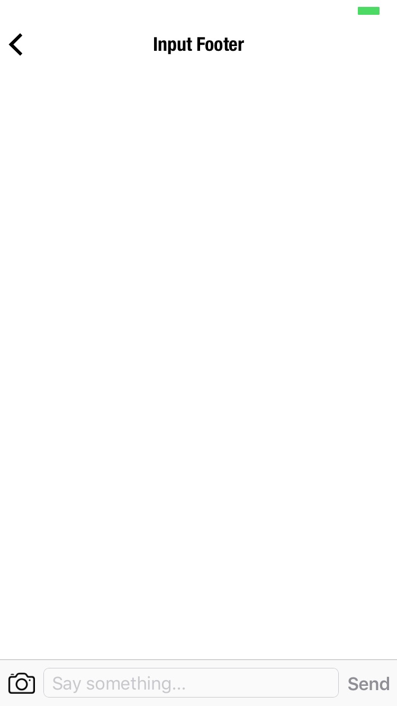

---

>##### Available attributes
>
>- `name`: the local variable name connected to the input field.
>- `placeholder`: placeholder text for the input field
>- `left`: left button
>	- `image`
>	- `action`
>- `right`: right button
>	- `text`
>	- `action`

##### Example

```
{
	"footer": {
		"input": {
			"name": "message",
			"placeholder": "Say something...",
			"left": {
				"image": "https://www.jasonclient.org/img/camera.png",
				"action": {
					"type": "$media.camera"
				}
			},
			"right": {
				"text": "Send",
				"action": {
					"type": "$network.request",
					"options": {
						"url": "https://jasonchat.org/post.json",
						"method": "post",
						"data": {
							"message": "{{$get.message}}"
						}
					},
					"success": {
						"type": "$reload"
					}
				}
			}
		}
	}
}
```

<h4 id='user-content-body-footer-tabs'>B. tabs</h4>
Bottom tab bar

**⚠️ DISCLAIMER: ONLY Use tabs at the root level (The first view that shows up on launch). Any other usage may introduce unexpected behavior.**

>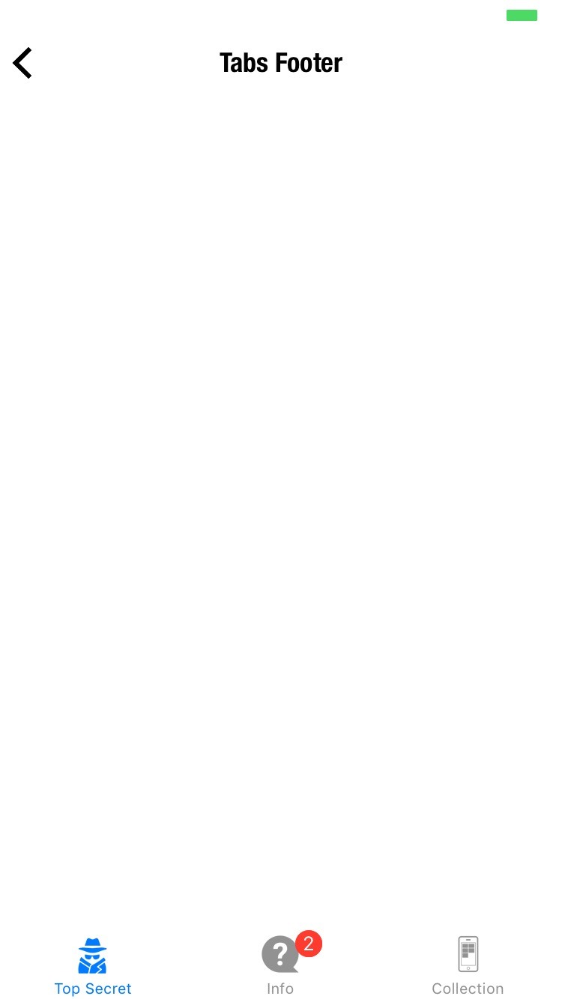

---

>##### Available attributes
>
>- items
>	- `text`: tab item text
>	- `image`: tab item icon
>	- `badge`: badge text
>- style
>	- `color`: selected color
>	- `color:disabled`: deselected color
>	- `background`


```
{
  "footer": {
    "tabs": {
      "items": [
        {
          "image": "https://s3-us-west-2.amazonaws.com/www.jasonclient.org/topsecret%402x.png",
          "text": "Top Secret",
          "url": "http://www.jasonbase.com/things/ppY.json"
        },
        {
          "image": "https://s3-us-west-2.amazonaws.com/fm.ethan.jason/info%402x.png",
          "text": "Info",
          "badge": "2",
          "url": "http://www.jasonbase.com/things/ppY.json"
        },
        {
          "image": "https://s3-us-west-2.amazonaws.com/fm.ethan.jason/apps%402x.png",
          "text": "Collection",
          "url": "http://www.jasonbase.com/things/ppY.json"
        }
      ],
      "style": {
        "color": "#ff0000",
        "color:disabled": "#cecece",
        "background": "#ffffff"
      }
    }
  }
}
```

<h3 id='user-content-body-style'>5. Style</h3>
Styling the body

#### Available attributes

- [background](#user-content-body-style-background)
- [border](#user-content-body-style-border)

---

<h5 id='body-style-background'>background</h5>
>
>Set the background for the entire view
>
>  - Format: `[COLOR CODE]` | `[IMAGE URL]` | `"camera"` | `{"type": "camera"}`
>
>    1. `COLOR CODE`: You can set the background color using color code. The color code can take the form of any of the following:
>      - rgb(144,233,233)
>      - rgba(255,255,255,0.3)
>      - #ff0000
>    2. `IMAGE URL`: You can set an image as the background. Simply use the image url
>    3. `"camera"`: You can set the device camera as background.
>    4. `{"type": "camera"}`: More advanced camera options
>      - By default the background uses the front facing camera.
>      - To use the back facing camera you can specify `device` attribute, like this:
>
>       <pre>{
>         "body": {
>           ....
>           "style": {
>             "background": {
>               "type": "camera",
>               "options": {
>                 "device": "back"
>               }
>             }
>           },
>           ....
>         }
>       }</pre>
>
>    [You can view a functional example here](http://www.jasonbase.com/things/XgL/edit)

>color | image | camera
>------|-------|---------
> | 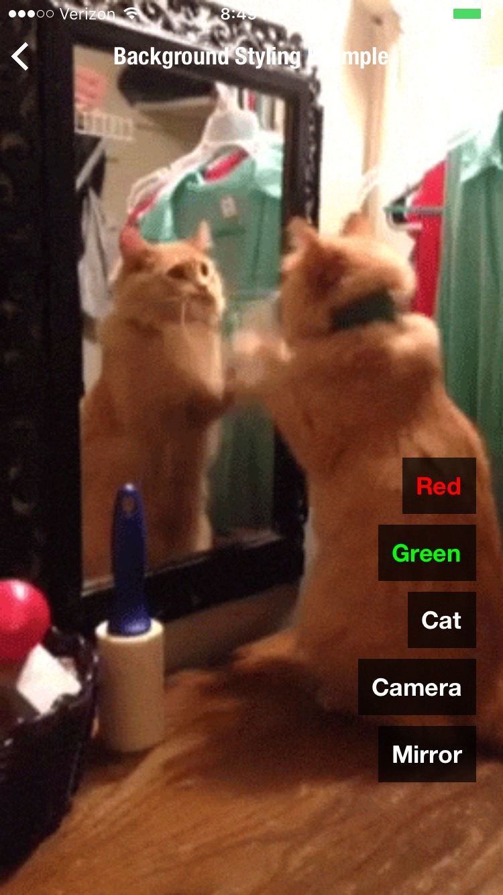 | 

<h5 id='body-style-border'>border</h5>
>
>- This applies only when the body contains a [sections](#user-content-body-sections) attribute.
>- Normally section items are separated by gray lines in between. These are called "border". You can set the color of these borders.
>
>  - Format: `[COLOR CODE]` | `"none"`
>    1. `COLOR CODE`: You can set the border color using color code. The color code can take the form of any of the following:
>      - rgb(144,233,233)
>      - rgba(255,255,255,0.3)
>      - #ff0000
>    2. `"none"`: No border
>
>  - Example:
>
>      <pre>{
>        "body": {
>          ....
>          "style": {
>            "border": "none"
>          },
>          ....
>        }
>      }</pre>
